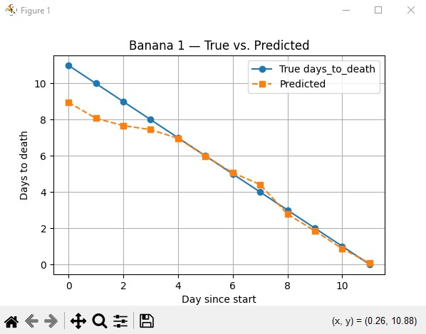

# 🍌 Banana Shelf-Life Prediction

[](https://www.python.org/)
[](#license)
[](https://github.com/ivanswetz/Banana_Shelf-Life_Prediction/issues)
[](https://github.com/ivanswetz/Banana_Shelf-Life_Prediction)

---

## 📋 Table of Contents

- [Overview](#overview)
- [Why This Matters](#why-this-matters)
- [Features](#features)
- [Installation](#installation)
- [Quick Start](#quick-start)
- [Project Structure](#project-structure)
- [Results & Visualization](#results--visualization)
- [License](#license)
- [Acknowledgments](#acknowledgments)

---

## 📖 Project Overview
This project applies **computer vision and regression modeling** to predict the **remaining shelf-life of bananas**. By estimating how many days are left before a banana becomes overripe, the model demonstrates how machine learning can solve real-world problems in food management and sustainability. 

It includes:
- **Training pipeline** for a CNN/regressor
- **Single-image prediction** script for quick checks
- **Evaluation & visualization** utilities
- **Clean project structure** and reproducible setup

---

## 📌 Why This Matters

Given a banana image, estimate the **remaining shelf-life (days)**. This can help with:
- **Food Waste Crisis**: Approximately 45% of all fruits and vegetables are wasted globally
- **Economic Impact**: Food waste costs the global economy $1 trillion annually
- **Banana Specific**: Bananas are among the most wasted fruits due to their perishable nature
- **Sustainability**: Better shelf-life prediction can significantly reduce carbon footprint
- **Education**: Educational demos of CV + ML workflows

---

## ✨ Features

1. **Data ingestion** → load images, optional labels (age or remaining days).  
2. **Transforms** → resize, normalize, augment (train only).  
3. **Backbone model** → lightweight CNN (e.g., EfficientNet/MobileNet/ResNet) with a regression head.  
4. **Loss** → MSE/MAE; **Metrics** → MAE, RMSE, R².  
5. **Training** → early stopping + model checkpointing.  
6. **Inference** → single image → predicted remaining days.  

---

## 🚀 Installation

### Prerequisites

- Python 3.10+ or higher
- pip package manager

### Step-by-Step Setup

1. **Clone the repository**
```bash
git clone https://github.com/ivanswetz/Banana_Shelf-Life_Prediction.git
cd Banana_Shelf-Life_Prediction
```

2. **Create virtual environment (recommended)**
```bash
python -m venv banana_env
source banana_env/bin/activate  # On Windows: banana_env\Scripts\activate
```

3. **Install dependencies**
```bash
pip install -r requirements.txt
```

---

## ▶️ Run the Pipeline
```bash
# 1) Build labeled feature table
python src/build_image_dataset.py

# (optional) smooth features to enforce monotonic color trends per banana
# python src/postprocess_monotonic.py    # if you added this small helper

# 2) Train calibrator (dark% → days)
python src/calibrate_dark_to_days.py

# 3) Extract features for unlabeled photos
python src/extract_unlabeled.py

# 4) Train final model (semi-supervised)
python src/pseudo_label_and_train.py
#   → saves model to data/models/banana_from_images.joblib
```
- Predict a photo
```bash
python src/predict_from_image.py
```

---

## 🗂️ Project Structure

```text
Banana_Shelf-Life_Prediction/
├─ data/
│  ├─ raw/                      # original images (read-only)
│  ├─ processed/                # resized/cleaned images (auto-created)
│  ├─ models/                   # image-based regression models built on top of Convolutional Neural Networks
│  ├─ labels.csv                # Initial data for original images
│  └─ plots/                    # plots for metrics
├─ src/
│  ├─ auto_crop.py              # utility to automatically crop bananas out of images (reduces background noise)
│  ├─ build_image_dataset.py    # loops through labeled banana sets, extracts features, and builds banana_images.csv
│  ├─ calibrate_dark_to_days.py # fits an isotonic regression mapping from dark% → days_to_death (monotonic decreasing). Saves model as days_from_dark_iso.joblib
│  ├─ eval_holdout_banana.py    # evaluates MAE on specific banana sets(1,2 or 3)
│  ├─ extract_unlabeled.py      # processes 1000 unlabeled banana photos, extracts yellow/dark%, and saves as unlabeled_features.csv
│  ├─ img_features.py           # defines color_percents(path) which extracts yellow% and dark% pixels from cropped banana images
│  ├─ main.py                   # this main is used for data manipulation to not enter data manually
│  ├─ plot_predictions.py       # builds plots for each banana set
│  ├─ predicts_from_image.py    # inference script: take a single photo, extract features, run trained model, print days-to-death
│  ├─ pseudo_label_and_train.py # temi-supervised model → adds pseudo-labels from isotonic calibration on unlabeled data. trains weighted Random Forest and saves banana_from_images.joblib
│  └─ train_from_images.py      # same as #pseudo_label_and_train but only for labeled data(banana sets 1,2,3)
├─ requirements.txt
├─ README.md
└─ .gitignore

```

---

## 📊 Results & Visualization

The following metrics were used to assess model performance:

- **Mean Absolute Error (MAE)**  
  - Measures the average difference between predicted and true shelf-life.  
  - Example: an MAE of **1.4 days** means predictions are off by about 1–2 days on average.  
  - **Impact**: At the household level, this is usually acceptable (eat bananas ~1 day earlier), but in retail, 1–2 days can be significant for stock rotation.  

- **Root Mean Square Error (RMSE)**  
  - Penalizes larger errors more heavily than MAE.  
  - Example: an RMSE of **1.9 days** shows that while most predictions are close, some bananas are mispredicted by 3–4 days.  
  - **Impact**: This highlights risk in edge cases — e.g., bananas predicted to last longer but spoiling early could cause waste.  

- **R² Score (Coefficient of Determination)**  
  - Indicates how much of the variance in shelf-life is explained by the model.  
  - Example: R² of **0.61** means the model explains 61% of the variability in banana aging.  
  - **Impact**: Demonstrates that while the model captures general trends, there’s still unexplained variance (lighting, dataset quality, natural ripening differences).

### Key Metrics
| banana_set | R^2 | MAE | RMSE |
|------------------|------------------|---------------------|-------------------------|
| 1              | 0.929   | 0.577    | 0.922          |
| 2              | 0.645   | 0.879    | 1.017          |
| 3              | 0.873   | 0.486    | 0.712          |

### Our models have also been rigorously evaluated on three distinct banana datasets

**Banana_Set_1**


---

**Banana_Set_2**


---

**Banana_Set_3**


---


